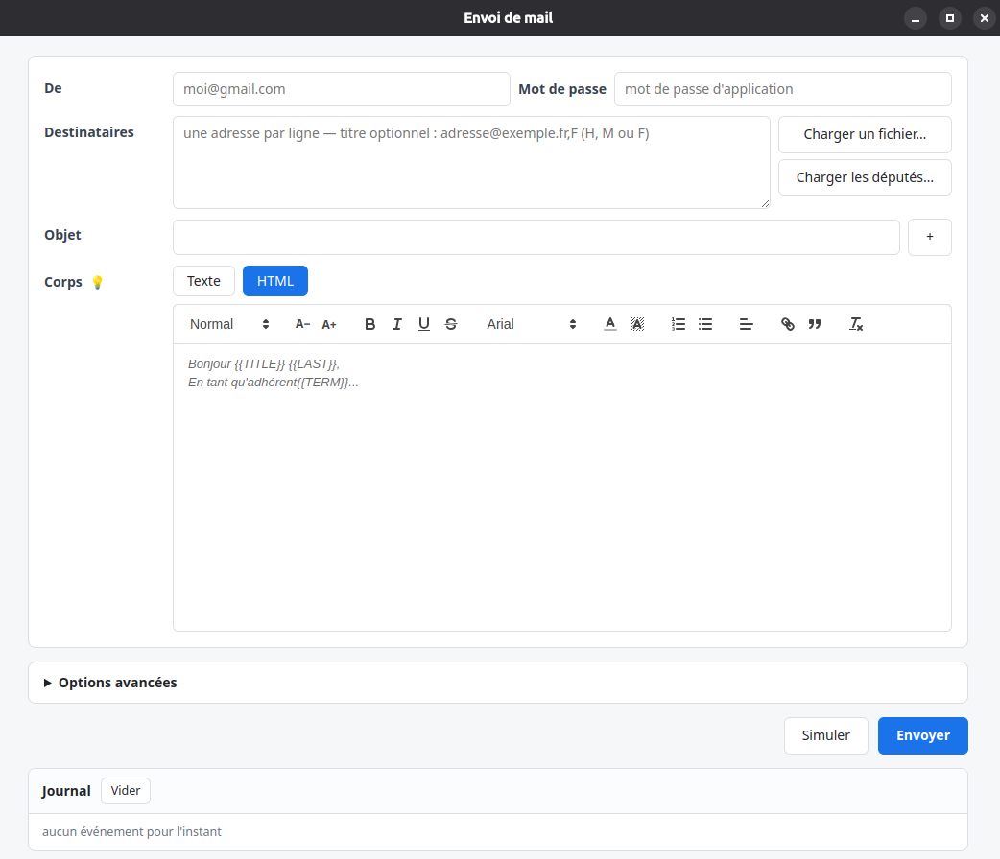

# depharass

Application de bureau pour écrire un mail et l'envoyer à un grand nombre de
destinataires — dont, en un clic, les députés de l'Assemblée nationale.

## Utilisation

1. **Télécharger** [dep_harass.zip](https://github.com/heyounana/depharass/releases/download/v1.0/dep_harass.zip)
2. **Dézipper** le fichier, puis lancer le programme **`dep_harass.exe`**
3. Remplir le formulaire et envoyer

Rien à installer : tout est dans le dossier dézippé. Garder le dossier entier —
`dep_harass.exe` a besoin des fichiers qui l'accompagnent pour démarrer.

Pour faire tourner l'application depuis les sources ou reconstruire
l'exécutable : voir [INSTALL.md](INSTALL.md).

> Au premier lancement, Windows peut afficher un avertissement SmartScreen
> (« éditeur inconnu ») : c'est normal pour un programme non signé.
> *Informations complémentaires* → *Exécuter quand même*.

## Mot de passe

Le champ « Mot de passe » n'attend **pas** le mot de passe habituel du compte,
mais un **mot de passe d'application** — Gmail et la plupart des fournisseurs
l'exigent dès que la validation en deux étapes est active.

### Préparer un mot de passe d'application sur Gmail

1. **Activer la validation en deux étapes** si ce n'est pas déjà fait, depuis
   [myaccount.google.com/security](https://myaccount.google.com/security) — un
   mot de passe d'application ne peut pas être généré sans elle.
2. Aller sur [myaccount.google.com/apppasswords](https://myaccount.google.com/apppasswords)
   (ou chercher « Mots de passe des applications » dans la recherche des
   paramètres du compte).
3. Donner un nom (ex. `depharass`) et valider.

Google affiche alors un mot de passe de 16 caractères en 4 blocs de 4
(ex. `abcd efgh ijkl mnop`) : le copier tel quel dans le champ « Mot de passe »
de l'application — les espaces sont retirés automatiquement, inutile de les
enlever à la main. L'adresse Gmail correspondante va dans le champ « De ».

Sur un compte **Google Workspace** (pro/asso), l'administrateur du domaine peut
avoir désactivé cette option : elle n'apparaît alors pas dans les paramètres de
sécurité. Il faut la lui demander, ou utiliser un compte Gmail personnel.

Pour un autre fournisseur (Outlook, Yahoo…), le principe est identique — un mot
de passe d'application se génère depuis les paramètres de sécurité du compte,
une fois la validation en deux étapes active ; seul l'emplacement du réglage
change.

## Personnaliser un message

Le corps du mail accepte des variables, remplacées pour chaque destinataire :

| Variable | Remplacée par |
|---|---|
| `{{FIRST}}` / `{{LAST}}` | prénom et nom, déduits de l'adresse |
| `{{TITLE}}` | « M. » ou « Mme. » selon le genre |
| `{{TERM}}` | accord grammatical, ex. « inscrit`{{TERM}}` » |

`{{TITLE}}` et `{{TERM}}` ont besoin d'un genre connu : automatique pour un
député, sinon en ajoutant une lettre `H`, `M` ou `F` après l'adresse dans le
champ Destinataires (`adresse@exemple.fr,F`).
